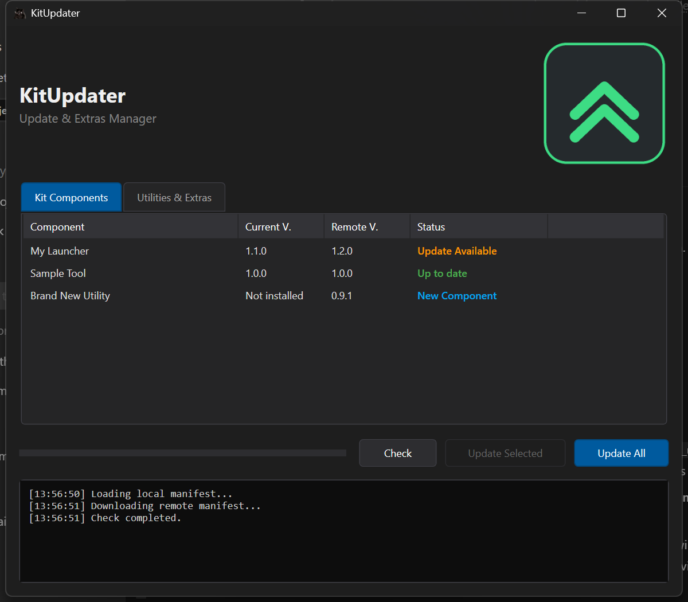
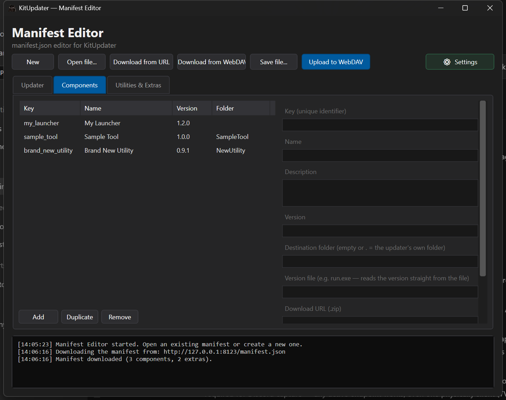
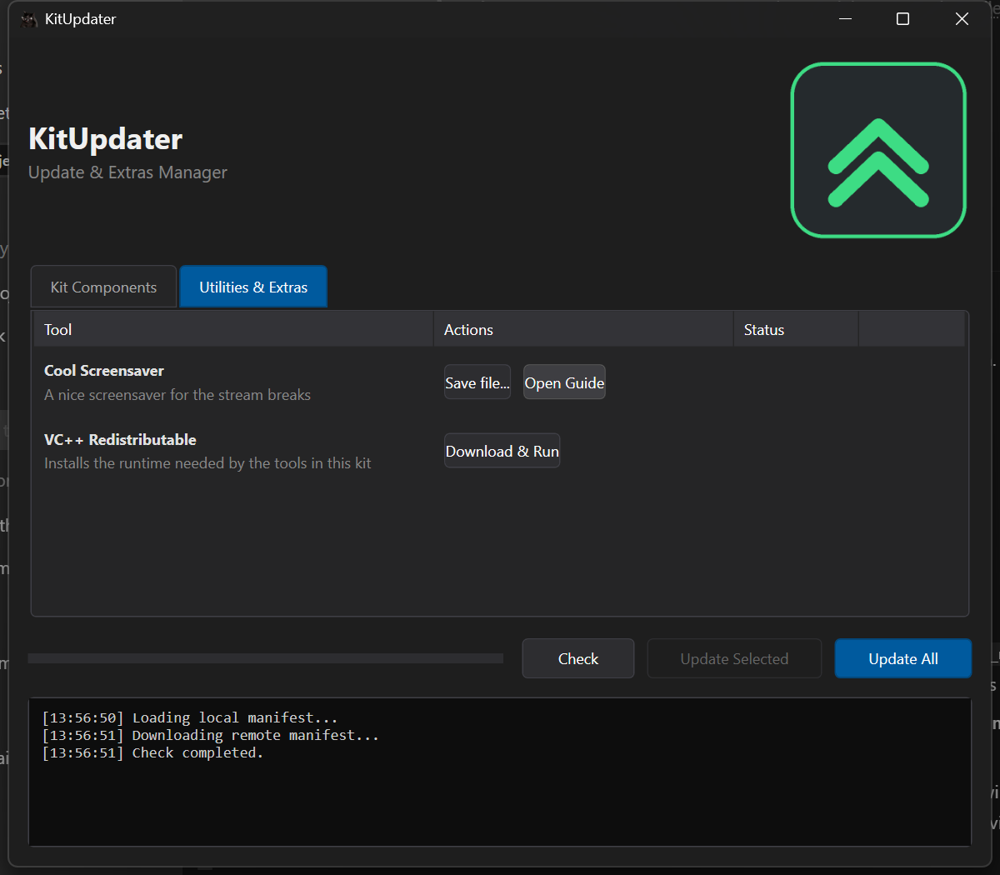

# KitUpdater

[](https://ko-fi.com/Marsic1)

A lightweight Windows updater that ships updates from a plain JSON manifest hosted on Nextcloud or any WebDAV server — **no update server, no database, no accounts required**.

This started as a personal project: I just wanted to keep my own kit of small utilities updated for my friends without running any infrastructure — everything I needed was already on my Nextcloud. It worked so well that I thought it could be useful to others, so I cleaned it up and published it. If it helps you, it made the world slightly more convenient. 🙂

## Screenshots

| The updater | The manifest editor |
|---|---|
|  |  |
| Extras tab | |
|  | |

## How it works

You host a `manifest.json` file (plus your component `.zip` archives) on **Nextcloud or any WebDAV server**. The updater is a single portable exe you drop next to your tools:

- **Components** — zip archives that get extracted into subfolders next to the updater — or into the updater's own folder (so you can update your launcher `run.exe` too).
- **Extras** — optional downloads: `save_as` (pick where to save) or `run_installer` (download, run, wait, clean up), each with an optional guide link.
- **Self-update** — the updater can even replace itself and restart, so you can ship updater improvements through the same mechanism.

Notable details:

- **Direct file versioning** — a component can declare a `version_file` (e.g. `run.exe`) and the updater reads the installed version straight from the binary's file version instead of trusting a local record. Falls back to a locally stored manifest when the field is absent.
- **Semantic version comparison** — `1.10.0` > `1.9.0`; downgrades and format differences (`1.0` vs `1.0.0`) don't trigger false updates.
- **Running files get replaced** — a locked exe (e.g. a running launcher) is renamed to `.old` (Windows allows this while it runs), the new version is extracted, the process is killed and relaunched after the batch, and leftovers are cleaned on next start.
- **Safe extraction** — absolute paths and `..` traversal (in folders or inside zips) are rejected.
- **`preserve_files`** — user files (configs etc.) are never overwritten, with exact-name or `*` wildcard rules.

## The manifest editor

`KitUpdaterEditor` is the companion tool for the maintainer (you):

- Add / remove / duplicate **components and extras** with a form UI — no hand-written JSON.
- **Download the live manifest** from your public URL or straight from WebDAV, edit it, and **upload it back with one click** — the manifest on your Nextcloud is always current, no file juggling.
- Full **validation before saving or uploading**: unique keys, valid versions and URLs, safe folder paths, consistent actions.
- Your Nextcloud credentials are stored encrypted (DPAPI, per-Windows-user) and never leave your machine in plain text.

## Manifest format

```json
{
  "updater_version": "1.0.0",
  "updater_url": "https://your-cloud/index.php/raw/Share/KitUpdater.exe",
  "updater_description": "changelog text shown in the self-update dialog",
  "components": {
    "my_launcher": {
      "name": "My Launcher",
      "description": "shown as tooltip",
      "version": "1.2.0",
      "folder": "",
      "version_file": "run.exe",
      "download_url": "https://your-cloud/index.php/raw/Share/my_launcher.zip",
      "preserve_files": ["config.ini", "*.cfg"]
    }
  },
  "extras": {
    "some_tool": {
      "name": "Some Tool",
      "description": "optional utility",
      "action": "save_as",
      "download_url": "https://.../tool.zip",
      "guide_url": "https://.../guide"
    }
  }
}
```

| Field | Meaning |
|-------|---------|
| `folder` | Destination relative to the updater exe. `""`, `"."` or `"./"` = the updater's own folder (use this to update `run.exe`). Absolute paths and `..` are rejected. |
| `version_file` | Optional. Relative path (inside the component folder) of an exe/dll whose **file version** is the installed version. If omitted, the local `manifest.json` written by the updater is used. |
| `preserve_files` | Files never overwritten if already present (exact names or `*` wildcards). |
| `action` | For extras: `save_as` (download with Save dialog), `run_installer` (download, run, wait, delete) or `none` (guide link only). |

## Quick start

1. Grab the [latest release](../../releases) (or build from source — see below). The zip contains an `updater` and an `editor` folder.
2. Put the updater exe into your tools folder.
3. Create `updater.config.json` next to it (see `updater.config.json.example`):

```json
{ "manifest_url": "https://your-cloud/index.php/raw/YourShare/manifest.json" }
```

4. In the editor, open Settings and fill in your Nextcloud/WebDAV details (server, username, **app password**, remote path, public share URL). Create your components, hit **Upload to WebDAV**, and put the download links in the manifest.
5. Distribute the updater exe to your users — from now on they always get the latest versions with one click.

### Hosting on Nextcloud or any WebDAV server

- The **manifest and zips** just need to be downloadable via direct links — a public Nextcloud share works (use the raw/download links), as does any static file host.
- The editor's **upload feature** needs WebDAV write access. On Nextcloud: create an app password (Settings → Security), then in the editor's Settings set the server URL, username, app password and the remote path (e.g. `/MyKit/manifest.json`). Any standard WebDAV server works the same way.

## Customization (no fork needed)

Brand your own build at **build time** using untracked files — `git pull` never conflicts, there is nothing to fork:

| File you drop in | Effect |
|---|---|
| `icon.custom.ico` (next to the updater csproj, or repo root for the editor) | Compiled into the exe as its icon, replacing the default |
| `logo.custom.png` (next to the updater csproj) | The logo in the top-right of the updater window |
| `Directory.Build.props` (repo root, see `Directory.Build.props.example`) | The names of the built exes (`KitUpdater.exe` → `YourUpdater.exe`) and the brand name shown in window titles and product info (`BrandName`) |

All three are git-ignored: keep them in your working copy, pull upstream improvements, rebuild — your branding reapplies automatically.

### Languages

Italian is the built-in language; additional languages are JSON packs in a `Languages\` folder next to the exe:

```
Languages/
  en.json
  de.json
  ...
```

Each pack maps the exact Italian string to a translation (any missing key simply falls back to Italian):

```json
{ "Aggiorna Tutto": "Update All" }
```

Language selection order: the `language` field in `updater.config.json` (updater) / `manifesteditor.config.json` (editor, also settable in the editor's Settings dialog) → the Windows display language → Italian. Both apps ship with `en.json`; new packs can be added at any time without recompiling.

> A runtime icon override also exists — an `app.ico` next to the exe switches window/taskbar icons without rebuilding — useful if you deploy the stock build but want your icon. For a fully branded exe, use the build-time files above.

## Building

Visual Studio 2022+ with the .NET Framework 4.8 developer pack, or:

```
msbuild KitUpdater.slnx -p:Configuration=Release
```

NuGet packages (Newtonsoft.Json, Fody, Costura.Fody) are expected under `packages\` — restore with `nuget restore` if missing. Costura embeds the dependencies, so each build output is a single portable exe.

## License

[MIT](LICENSE) — do whatever you like, attribution appreciated.
